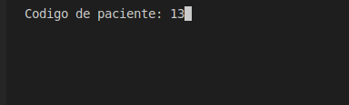
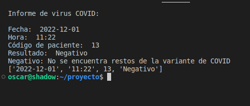

## Comentario

### Se importan la librería del S.O. y random
import os
os.system("clear")

import random

### Se genera el genoma aleatorio.
longitud = 50
caracteres = "cuga"
cadena = " "
for _ in range(longitud):
    cadena += random.SystemRandom().choice(caracteres)

### Se busca la variante de COVID y se da el resultado positivo o negativo.
busqueda = cadena.find("ccucggcgggca")

if busqueda != -1:
    resultado = "Positivo"
else:
    resultado = "Negativo"

### Se importan las librerías para la fecha y hora.
from datetime import date
from datetime import datetime

now = datetime.now()
fecha = date.today()
hora = now.strftime("%H:%M")

### Se pregunta por el codigo de paciente y antes informar el resultado se limpia la pantalla.
codigo_paciente = int(input("Codigo de paciente: "))

os.system("clear")

### Se imprime en pantalla los resultados.
print("Informe de virus COVID: ")
print (" ")
print("Fecha: ", fecha)
print("Hora: ", hora)
print("Código de paciente: ", codigo_paciente)
print("Resultado: ", resultado)
if resultado == "Positivo":
    print("Positivo: Sí sen encuentra restos de la variante de COVID")
else:
    print("Negativo: No se encuentra restos de la variante de COVID")

### Aquí se crea la tupla con los resultados.
lista = [str(fecha), hora, codigo_paciente, resultado]

print(lista)

## Ejecución

